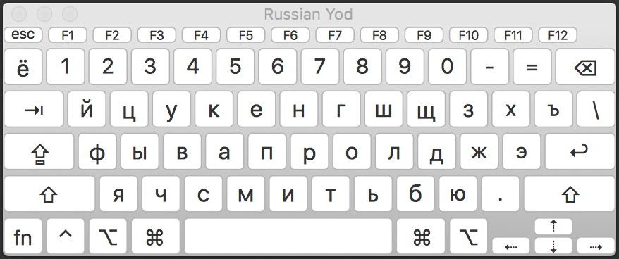
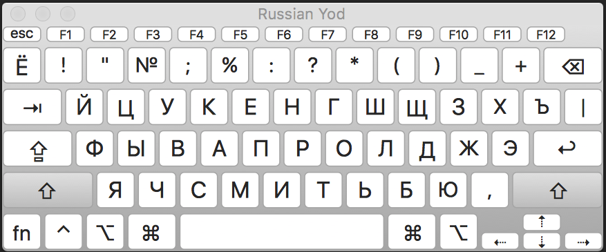
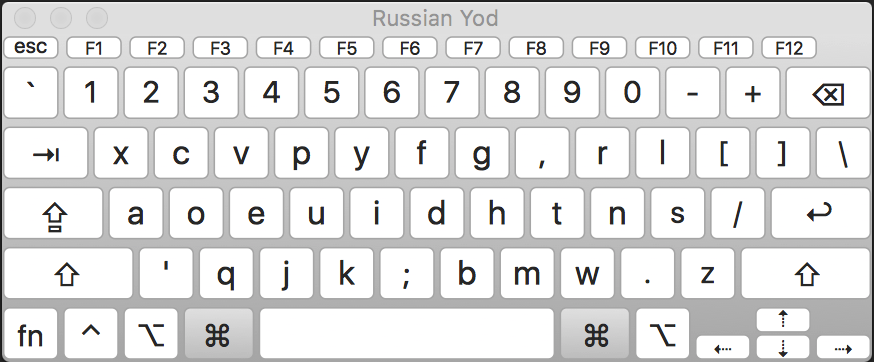
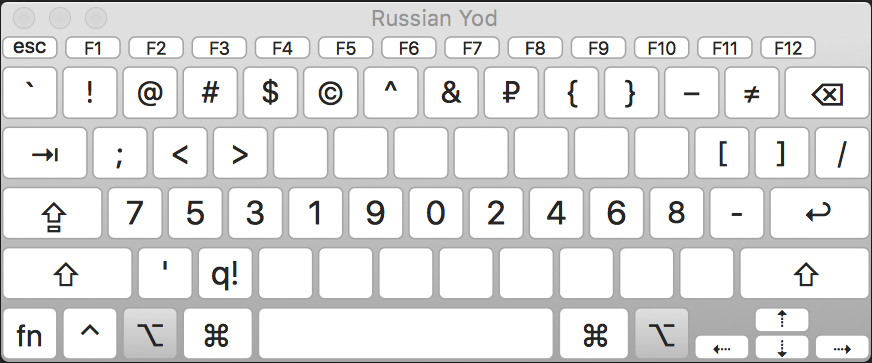
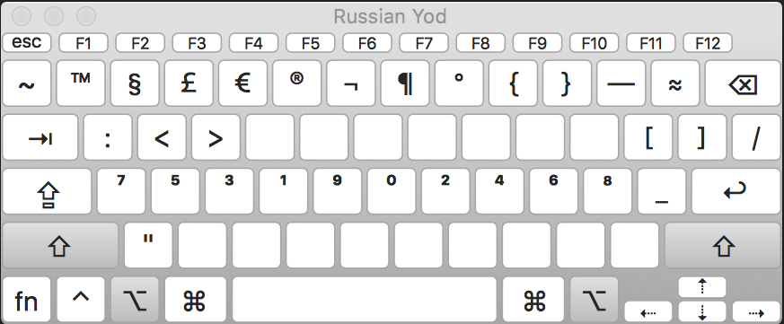

Раскладка "Russian Yod" для MacOS
===========

В данной раскладке буква `Ё` находится там где ей и полагается быть - а именно
над табом.

Шорткаты `cmd + x`, `cmd + c` и `cmd + v` перекачевали из позиций `ч` `с` `м` в  позиции `й` `ц` `у` соответственно, потому что я пользуюсь раскладкой [Deep Dvorak](https://github.com/vbauerster/DeepDvorak).

## Установка

Для того, чтобы готовую раскладку «увидела» система, её необходимо разметить в одной из трёх папок:
* /Library/Keyboard Layout — раскладка будет работать для всех пользователей на данном компьютере;
* ~/Library/Keyboard Layouts — раскладка будет работать только для вас;
* /Network/Library/Keyboard Layouts — раскладка будет доступна в локальной сети.

При наличии прав администратора можно установить из командной строки, следующим образом:

`sudo cp -vr ruyod.bundle /Library/Keyboard\ Layouts`

### Screenshots

* **Обычный режим**

* **SHIFT ⇧**

* **Command ⌘**

* **OPTION ⌥**

* **SHIFT+OPTION  (⇧+⌥)**

